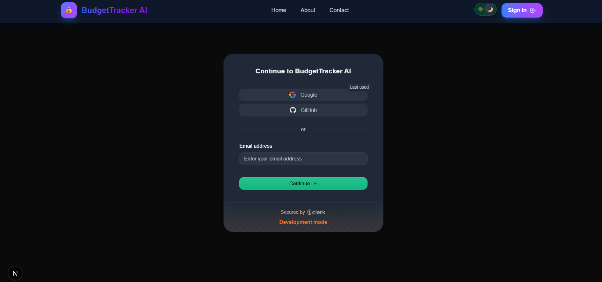
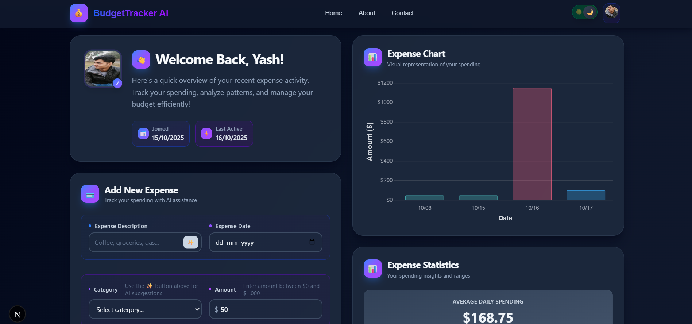

# 💸 BudgetTracker AI

A *student-built, AI-powered expense tracker* that helps you understand your spending patterns, categorize expenses intelligently, and manage budgets efficiently.  
Track expenses, gain insights, and visualize trends with **Chart.js** – all in one place.

🌐 *Live Demo*: [BudgetTracker AI](https://budget-tracker-ai-ys.vercel.app/)

---

## ✨ Features

- 🤖 **AI-Powered Insights**  
  - Categorizes expenses automatically  
  - Provides smart spending analysis  

- ✨ **Smart Categorization**  
  - Learns from your usage over time  
  - Groups expenses intelligently  

- 📊 **Interactive Dashboards**  
  - Visualize trends using **Chart.js**  
  - Track best & worst expenses  

- 🔐 **Authentication & Security**  
  - Sign up / Sign in via Email, Google, or GitHub using **Clerk**  

- 📱 **Responsive & Modern UI**  
  - Light/Dark mode toggle  
  - Mobile + Desktop friendly  
  - Clean, minimalistic dashboard  

---

## 🖼 Screenshots

### 🔐 Authentication
  
  

### 🏠 Dashboard
  

### 📊 Expense Analytics
  

---

## 🛠 Tech Stack

**Frontend:**  
- Next.js  
- React + TypeScript  
- TailwindCSS  
- Axios  
- Chart.js  
- Clerk  

**Backend:**  
- Node.js + Express  
- MongoDB Atlas  
- OpenRouter AI integration  

### AI & Authentication

- **[OpenRouter](https://openrouter.ai)** - Free AI API access without credit cards
- **[Clerk](https://go.clerk.com/WSe7K8F)** - Complete authentication solution
- **OpenAI Compatible API** - For intelligent expense categorization

### Deployment

- **[Vercel](https://vercel.com)** - Serverless deployment platform

## 🚀 Getting Started

### Prerequisites

- Node.js 18+
- npm, yarn, or pnpm

### Installation

1. **Clone the repository**

   ```bash
   git clone https://github.com/sahandghavidel/next-expense-tracker-ai.git
   cd next-expense-tracker-ai
   ```

2. **Install dependencies**

   ```bash
   npm install
   # or
   yarn install
   # or
   pnpm install
   ```

3. **Set up environment variables**
   Create a `.env` file in the root directory:

   ```env
   # Database
   DATABASE_URL="your-neon-database-url"

   # Clerk Authentication
   NEXT_PUBLIC_CLERK_PUBLISHABLE_KEY="your-clerk-publishable-key"
   CLERK_SECRET_KEY="your-clerk-secret-key"
   NEXT_PUBLIC_CLERK_SIGN_IN_URL="/sign-in"
   NEXT_PUBLIC_CLERK_SIGN_IN_FALLBACK_REDIRECT_URL="/"
   NEXT_PUBLIC_CLERK_SIGN_UP_FALLBACK_REDIRECT_URL="/"

   # OpenRouter AI
   OPENROUTER_API_KEY="your-openrouter-api-key"

   # App URL
   NEXT_PUBLIC_APP_URL="http://localhost:3000"
   ```

4. **Set up the database**

   ```bash
   npx prisma generate
   npx prisma db push
   ```

5. **Run the development server**

   ```bash
   npm run dev
   # or
   yarn dev
   # or
   pnpm dev
   ```

6. **Open your browser**
   Navigate to [http://localhost:3000](http://localhost:3000)

## 👤 Author  

*Yash Kumar Singh*  
*NIT Durgapur (2024-2028)*
- GitHub: [coder40425](https://github.com/coder40425)  
- LinkedIn: [Yash Kumar Singh](https://www.linkedin.com/in/yash-kumar-singh-18843232a)
